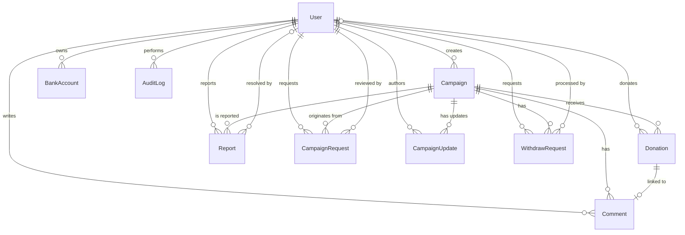
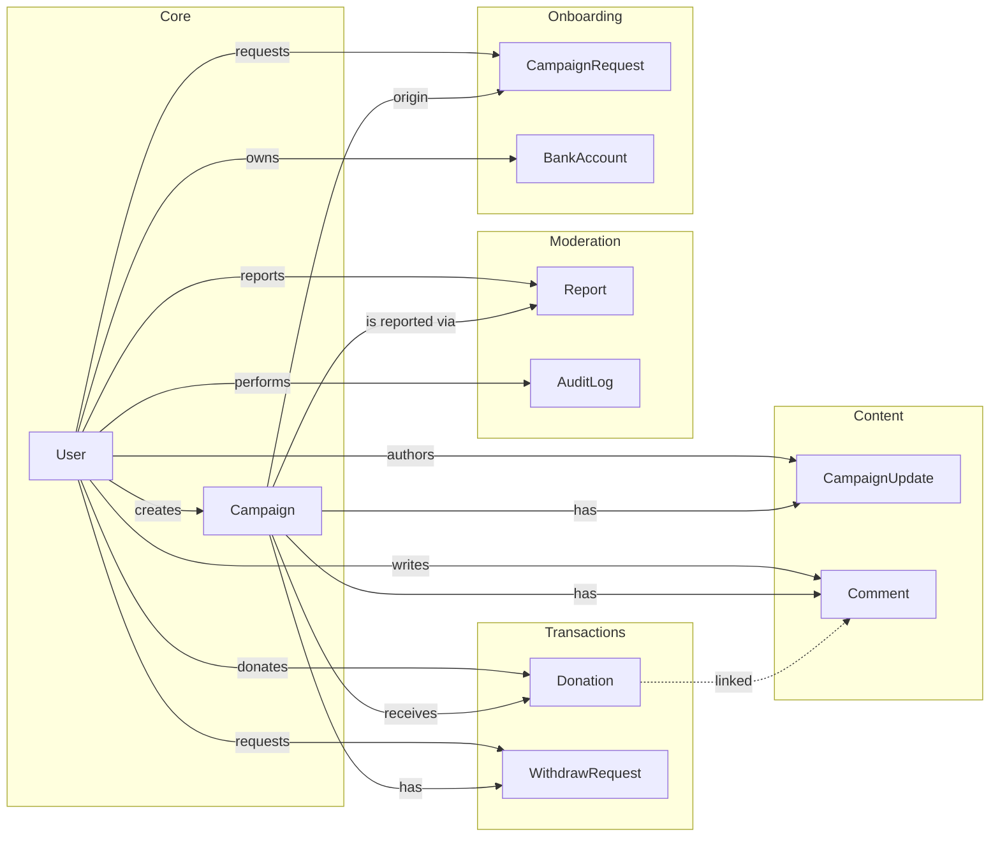

# SCharity_BE — Entities & Relationships

Tài liệu mô tả chi tiết các thực thể (Entity) trong dự án SCharity_BE cùng các trường dữ liệu và mối quan hệ giữa chúng.

> Tất cả entity sử dụng **TypeORM** với **PostgreSQL**. Primary Key mặc định là UUID.

---

## Tổng quan các Entity

| #   | Entity              | Table               | Mô tả                                    |
| --- | ------------------- | ------------------- | ---------------------------------------- |
| 1   | **User**            | `users`             | Người dùng hệ thống (admin / user)       |
| 2   | **Campaign**        | `campaigns`         | Chiến dịch gây quỹ từ thiện              |
| 3   | **CampaignRequest** | `campaign_requests` | Yêu cầu tạo chiến dịch (chờ admin duyệt) |
| 4   | **CampaignUpdate**  | `campaign_updates`  | Bài cập nhật tiến độ cho chiến dịch      |
| 5   | **Donation**        | `donations`         | Giao dịch quyên góp                      |
| 6   | **WithdrawRequest** | `withdraw_requests` | Yêu cầu rút tiền từ chiến dịch           |
| 7   | **BankAccount**     | `bank_accounts`     | Tài khoản ngân hàng của người dùng       |
| 8   | **Comment**         | `comments`          | Bình luận trên chiến dịch                |
| 9   | **Report**          | `reports`           | Báo cáo vi phạm chiến dịch               |
| 10  | **AuditLog**        | `audit_logs`        | Nhật ký hành động quản trị               |

---

## Sơ đồ quan hệ (ER Diagram)

---

## Chi tiết từng Entity

---

### 1. User

> **Table:** `users` — Người dùng hệ thống.

#### Enums

| Enum         | Giá trị                           |
| ------------ | --------------------------------- |
| `UserRole`   | `admin`, `user`                   |
| `UserStatus` | `active`, `inactive`, `suspended` |

#### Các trường

| Trường                   | Kiểu               | Ràng buộc                 | Mô tả                                   |
| ------------------------ | ------------------ | ------------------------- | --------------------------------------- |
| `id`                     | `uuid`             | PK, auto-generated        | Mã định danh                            |
| `email`                  | `string`           | **unique**                | Địa chỉ email                           |
| `password`               | `string`           | nullable, `select: false` | Mật khẩu (hash), không trả về khi query |
| `fullName`               | `string`           | required                  | Họ tên đầy đủ                           |
| `role`                   | `enum(UserRole)`   | default: `user`           | Vai trò                                 |
| `status`                 | `enum(UserStatus)` | default: `active`         | Trạng thái tài khoản                    |
| `avatarUrl`              | `string`           | nullable                  | URL ảnh đại diện                        |
| `phoneNumber`            | `string`           | nullable                  | Số điện thoại                           |
| `googleId`               | `string`           | nullable                  | ID Google (đăng nhập qua Google)        |
| `isEmailVerified`        | `boolean`          | default: `false`          | Email đã xác thực chưa                  |
| `isKycVerified`          | `boolean`          | default: `false`          | KYC đã xác thực chưa                    |
| `emailVerificationToken` | `string`           | nullable                  | Token xác thực email                    |
| `passwordResetToken`     | `string`           | nullable                  | Token reset mật khẩu                    |
| `passwordResetExpires`   | `timestamp`        | nullable                  | Thời hạn token reset                    |
| `createdAt`              | `timestamp`        | auto                      | Ngày tạo                                |
| `updatedAt`              | `timestamp`        | auto                      | Ngày cập nhật                           |

#### Quan hệ

| Quan hệ        | Entity đích | Kiểu      | Mô tả                        |
| -------------- | ----------- | --------- | ---------------------------- |
| `campaigns`    | Campaign    | OneToMany | Các chiến dịch do user tạo   |
| `donations`    | Donation    | OneToMany | Các khoản quyên góp của user |
| `reports`      | Report      | OneToMany | Các báo cáo user đã gửi      |
| `bankAccounts` | BankAccount | OneToMany | Các tài khoản ngân hàng      |

---

### 2. Campaign

> **Table:** `campaigns` — Chiến dịch gây quỹ từ thiện.
>
> **Index:** `status`, `creatorId`

#### Enums

| Enum               | Giá trị                                                                 |
| ------------------ | ----------------------------------------------------------------------- |
| `CampaignStatus`   | `pending`, `active`, `closed`, `suspended`, `completed`, `withdrawn`    |
| `CampaignCategory` | `education`, `medical`, `disaster`, `community`, `environment`, `other` |

#### Các trường

| Trường          | Kiểu                     | Ràng buộc          | Mô tả                            |
| --------------- | ------------------------ | ------------------ | -------------------------------- |
| `id`            | `uuid`                   | PK, auto-generated | Mã định danh                     |
| `title`         | `string`                 | required           | Tiêu đề chiến dịch               |
| `story`         | `text`                   | required           | Câu chuyện / nội dung chiến dịch |
| `goalAmount`    | `decimal(15,0)`          | required           | Số tiền mục tiêu                 |
| `raisedAmount`  | `decimal(15,0)`          | default: `0`       | Số tiền đã quyên góp được        |
| `deadline`      | `timestamp`              | required           | Hạn chót chiến dịch              |
| `status`        | `enum(CampaignStatus)`   | default: `pending` | Trạng thái                       |
| `category`      | `enum(CampaignCategory)` | default: `other`   | Danh mục                         |
| `thumbnailUrl`  | `string`                 | nullable           | Ảnh thumbnail                    |
| `mediaUrls`     | `simple-array`           | nullable           | Danh sách URL media              |
| `suspendReason` | `string`                 | nullable           | Lý do bị tạm ngưng               |
| `suspendedAt`   | `timestamp`              | nullable           | Thời điểm bị tạm ngưng           |
| `closedAt`      | `timestamp`              | nullable           | Thời điểm đóng                   |
| `approvedAt`    | `timestamp`              | nullable           | Thời điểm được duyệt             |
| `creatorId`     | `string`                 | FK → User          | ID người tạo                     |
| `donorCount`    | `number`                 | default: `0`       | Số lượng người quyên góp         |
| `reportCount`   | `number`                 | default: `0`       | Số lượng báo cáo                 |
| `createdAt`     | `timestamp`              | auto               | Ngày tạo                         |
| `updatedAt`     | `timestamp`              | auto               | Ngày cập nhật                    |

#### Computed Properties (getter)

| Property            | Mô tả                                                                     |
| ------------------- | ------------------------------------------------------------------------- |
| `progressPercent`   | Phần trăm tiến độ gây quỹ (`raisedAmount / goalAmount * 100`, tối đa 100) |
| `isDeadlineReached` | Đã quá hạn chưa                                                           |
| `canClose`          | Có thể đóng khi đạt ≥ 50% hoặc quá hạn                                    |
| `canWithdraw`       | Có thể rút tiền khi status = `closed` và creator đã KYC                   |

#### Quan hệ

| Quan hệ            | Entity đích     | Kiểu      | FK          | Mô tả                                |
| ------------------ | --------------- | --------- | ----------- | ------------------------------------ |
| `creator`          | User            | ManyToOne | `creatorId` | Người tạo chiến dịch                 |
| `donations`        | Donation        | OneToMany | —           | Các khoản quyên góp                  |
| `withdrawRequests` | WithdrawRequest | OneToMany | —           | Các yêu cầu rút tiền                 |
| `reports`          | Report          | OneToMany | —           | Các báo cáo vi phạm                  |
| `updates`          | CampaignUpdate  | OneToMany | —           | Các bài cập nhật                     |
| `requests`         | CampaignRequest | OneToMany | —           | Các yêu cầu tạo chiến dịch liên quan |

---

### 3. CampaignRequest

> **Table:** `campaign_requests` — Yêu cầu tạo chiến dịch mới, chờ admin phê duyệt.
>
> **Index:** `status`, `requesterId`

#### Enum

| Enum                    | Giá trị                           |
| ----------------------- | --------------------------------- |
| `CampaignRequestStatus` | `pending`, `approved`, `rejected` |

#### Các trường

| Trường           | Kiểu                          | Ràng buộc               | Mô tả                                                                  |
| ---------------- | ----------------------------- | ----------------------- | ---------------------------------------------------------------------- |
| `id`             | `uuid`                        | PK, auto-generated      | Mã định danh                                                           |
| `title`          | `string`                      | required                | Tiêu đề                                                                |
| `story`          | `text`                        | required                | Nội dung câu chuyện                                                    |
| `goalAmount`     | `decimal(15,0)`               | required                | Số tiền mục tiêu                                                       |
| `deadline`       | `timestamp`                   | required                | Hạn chót                                                               |
| `thumbnailUrl`   | `string`                      | nullable                | Ảnh thumbnail                                                          |
| `mediaUrls`      | `simple-array`                | nullable                | Danh sách URL media                                                    |
| `category`       | `string`                      | nullable                | Danh mục                                                               |
| `status`         | `enum(CampaignRequestStatus)` | default: `pending`      | Trạng thái duyệt                                                       |
| `rejectReason`   | `text`                        | nullable                | Lý do từ chối                                                          |
| `bankInfo`       | `jsonb`                       | nullable                | Thông tin ngân hàng (`bankName`, `accountNumber`, `accountHolderName`) |
| `proofDocuments` | `jsonb`                       | nullable                | Danh sách tài liệu chứng minh                                          |
| `requesterId`    | `string`                      | FK → User               | ID người yêu cầu                                                       |
| `reviewedById`   | `string`                      | FK → User, nullable     | ID admin duyệt                                                         |
| `reviewedAt`     | `timestamp`                   | nullable                | Thời điểm duyệt                                                        |
| `campaignId`     | `string`                      | FK → Campaign, nullable | ID chiến dịch đã tạo (nếu approved)                                    |
| `createdAt`      | `timestamp`                   | auto                    | Ngày tạo                                                               |
| `updatedAt`      | `timestamp`                   | auto                    | Ngày cập nhật                                                          |

#### Quan hệ

| Quan hệ      | Entity đích | Kiểu      | FK             | Mô tả                          |
| ------------ | ----------- | --------- | -------------- | ------------------------------ |
| `requester`  | User        | ManyToOne | `requesterId`  | Người gửi yêu cầu              |
| `reviewedBy` | User        | ManyToOne | `reviewedById` | Admin đã duyệt                 |
| `campaign`   | Campaign    | ManyToOne | `campaignId`   | Chiến dịch được tạo từ yêu cầu |

---

### 4. CampaignUpdate

> **Table:** `campaign_updates` — Bài cập nhật tiến độ chiến dịch.
>
> **Index:** `campaignId`

#### Enum

| Enum             | Giá trị                                                         |
| ---------------- | --------------------------------------------------------------- |
| `UpdateCategory` | `progress`, `financial`, `thank_you`, `other`, `after_campaign` |

#### Các trường

| Trường       | Kiểu                   | Ràng buộc           | Mô tả                  |
| ------------ | ---------------------- | ------------------- | ---------------------- |
| `id`         | `uuid`                 | PK, auto-generated  | Mã định danh           |
| `title`      | `varchar(100)`         | required            | Tiêu đề cập nhật       |
| `content`    | `text`                 | required            | Nội dung cập nhật      |
| `category`   | `enum(UpdateCategory)` | default: `progress` | Loại cập nhật          |
| `mediaUrls`  | `simple-array`         | nullable            | Danh sách URL media    |
| `isEdited`   | `boolean`              | default: `false`    | Đã chỉnh sửa chưa      |
| `editedAt`   | `timestamp`            | nullable            | Thời điểm chỉnh sửa    |
| `isDraft`    | `boolean`              | default: `false`    | Có phải bản nháp không |
| `campaignId` | `string`               | FK → Campaign       | ID chiến dịch          |
| `creatorId`  | `string`               | FK → User           | ID người viết          |
| `createdAt`  | `timestamp`            | auto                | Ngày tạo               |
| `updatedAt`  | `timestamp`            | auto                | Ngày cập nhật          |

#### Quan hệ

| Quan hệ    | Entity đích | Kiểu      | FK           | Mô tả                   |
| ---------- | ----------- | --------- | ------------ | ----------------------- |
| `campaign` | Campaign    | ManyToOne | `campaignId` | Chiến dịch liên quan    |
| `creator`  | User        | ManyToOne | `creatorId`  | Người viết bài cập nhật |

---

### 5. Donation

> **Table:** `donations` — Giao dịch quyên góp.
>
> **Index:** `campaignId`, `donorId`, `status`, `createdAt`

#### Enums

| Enum             | Giá trị                                    |
| ---------------- | ------------------------------------------ |
| `DonationStatus` | `pending`, `success`, `failed`, `refunded` |
| `PaymentMethod`  | `vnpay`, `momo`, `stripe`, `bank_transfer` |

#### Các trường

| Trường            | Kiểu                   | Ràng buộc           | Mô tả                                 |
| ----------------- | ---------------------- | ------------------- | ------------------------------------- |
| `id`              | `uuid`                 | PK, auto-generated  | Mã định danh                          |
| `amount`          | `decimal(15,0)`        | required            | Số tiền quyên góp                     |
| `status`          | `enum(DonationStatus)` | default: `pending`  | Trạng thái giao dịch                  |
| `paymentMethod`   | `enum(PaymentMethod)`  | nullable            | Phương thức thanh toán                |
| `transactionRef`  | `string`               | nullable            | Mã tham chiếu giao dịch               |
| `message`         | `text`                 | nullable            | Lời nhắn từ người quyên góp           |
| `isAnonymous`     | `boolean`              | default: `false`    | Quyên góp ẩn danh                     |
| `bankName`        | `string`               | nullable            | Tên ngân hàng                         |
| `bankAccount`     | `string`               | nullable            | Số tài khoản                          |
| `campaignId`      | `string`               | FK → Campaign       | ID chiến dịch                         |
| `donorId`         | `string`               | FK → User, nullable | ID người quyên góp (null nếu ẩn danh) |
| `donorName`       | `string`               | nullable            | Tên người quyên góp                   |
| `paymentMetadata` | `jsonb`                | nullable            | Metadata bổ sung từ cổng thanh toán   |
| `createdAt`       | `timestamp`            | auto                | Ngày tạo                              |
| `updatedAt`       | `timestamp`            | auto                | Ngày cập nhật                         |

#### Quan hệ

| Quan hệ    | Entity đích | Kiểu      | FK           | Mô tả                     |
| ---------- | ----------- | --------- | ------------ | ------------------------- |
| `campaign` | Campaign    | ManyToOne | `campaignId` | Chiến dịch được quyên góp |
| `donor`    | User        | ManyToOne | `donorId`    | Người quyên góp           |

---

### 6. WithdrawRequest

> **Table:** `withdraw_requests` — Yêu cầu rút tiền từ chiến dịch.
>
> **Index:** `status`, `campaignId`

#### Enum

| Enum             | Giá trị                                        |
| ---------------- | ---------------------------------------------- |
| `WithdrawStatus` | `pending`, `approved`, `rejected`, `completed` |

#### Các trường

| Trường          | Kiểu                   | Ràng buộc           | Mô tả                                                                  |
| --------------- | ---------------------- | ------------------- | ---------------------------------------------------------------------- |
| `id`            | `uuid`                 | PK, auto-generated  | Mã định danh                                                           |
| `amount`        | `decimal(15,0)`        | required            | Số tiền yêu cầu rút                                                    |
| `status`        | `enum(WithdrawStatus)` | default: `pending`  | Trạng thái                                                             |
| `rejectReason`  | `text`                 | nullable            | Lý do từ chối                                                          |
| `bankInfo`      | `jsonb`                | required            | Thông tin ngân hàng (`bankName`, `accountNumber`, `accountHolderName`) |
| `campaignId`    | `string`               | FK → Campaign       | ID chiến dịch                                                          |
| `requesterId`   | `string`               | FK → User           | ID người yêu cầu                                                       |
| `processedById` | `string`               | FK → User, nullable | ID admin xử lý                                                         |
| `processedAt`   | `timestamp`            | nullable            | Thời điểm xử lý                                                        |
| `createdAt`     | `timestamp`            | auto                | Ngày tạo                                                               |
| `updatedAt`     | `timestamp`            | auto                | Ngày cập nhật                                                          |

#### Quan hệ

| Quan hệ       | Entity đích | Kiểu      | FK              | Mô tả                  |
| ------------- | ----------- | --------- | --------------- | ---------------------- |
| `campaign`    | Campaign    | ManyToOne | `campaignId`    | Chiến dịch liên quan   |
| `requester`   | User        | ManyToOne | `requesterId`   | Người yêu cầu rút tiền |
| `processedBy` | User        | ManyToOne | `processedById` | Admin xử lý yêu cầu    |

---

### 7. BankAccount

> **Table:** `bank_accounts` — Tài khoản ngân hàng liên kết với user.
>
> **Index:** `userId`

#### Các trường

| Trường              | Kiểu        | Ràng buộc          | Mô tả              |
| ------------------- | ----------- | ------------------ | ------------------ |
| `id`                | `uuid`      | PK, auto-generated | Mã định danh       |
| `bankName`          | `string`    | required           | Tên ngân hàng      |
| `accountNumber`     | `string`    | required           | Số tài khoản       |
| `accountHolderName` | `string`    | required           | Tên chủ tài khoản  |
| `isDefault`         | `boolean`   | default: `false`   | Tài khoản mặc định |
| `userId`            | `string`    | FK → User          | ID người dùng      |
| `createdAt`         | `timestamp` | auto               | Ngày tạo           |
| `updatedAt`         | `timestamp` | auto               | Ngày cập nhật      |

#### Quan hệ

| Quan hệ | Entity đích | Kiểu      | FK       | Mô tả                  |
| ------- | ----------- | --------- | -------- | ---------------------- |
| `user`  | User        | ManyToOne | `userId` | Người sở hữu tài khoản |

---

### 8. Comment

> **Table:** `comments` — Bình luận trên chiến dịch.
>
> **Index:** `campaignId`, `donorId`

#### Các trường

| Trường        | Kiểu        | Ràng buộc               | Mô tả                        |
| ------------- | ----------- | ----------------------- | ---------------------------- |
| `id`          | `uuid`      | PK, auto-generated      | Mã định danh                 |
| `content`     | `text`      | required                | Nội dung bình luận           |
| `emoji`       | `string`    | nullable                | Emoji đi kèm                 |
| `isAnonymous` | `boolean`   | default: `false`        | Bình luận ẩn danh            |
| `campaignId`  | `string`    | FK → Campaign           | ID chiến dịch                |
| `donorId`     | `string`    | FK → User               | ID người bình luận (donor)   |
| `donationId`  | `string`    | FK → Donation, nullable | ID khoản quyên góp liên quan |
| `isEdited`    | `boolean`   | default: `false`        | Đã chỉnh sửa chưa            |
| `editedAt`    | `timestamp` | nullable                | Thời điểm chỉnh sửa          |
| `createdAt`   | `timestamp` | auto                    | Ngày tạo                     |
| `updatedAt`   | `timestamp` | auto                    | Ngày cập nhật                |

#### Quan hệ

| Quan hệ    | Entity đích | Kiểu      | FK           | Mô tả                              |
| ---------- | ----------- | --------- | ------------ | ---------------------------------- |
| `campaign` | Campaign    | ManyToOne | `campaignId` | Chiến dịch được bình luận          |
| `donor`    | User        | ManyToOne | `donorId`    | Người bình luận                    |
| `donation` | Donation    | ManyToOne | `donationId` | Khoản quyên góp liên quan (nếu có) |

---

### 9. Report

> **Table:** `reports` — Báo cáo vi phạm chiến dịch.
>
> **Index:** `status`, `campaignId`

#### Enums

| Enum           | Giá trị                                                          |
| -------------- | ---------------------------------------------------------------- |
| `ReportStatus` | `pending`, `reviewed`, `resolved`                                |
| `ReportReason` | `false_information`, `fake_image`, `no_update`, `fraud`, `other` |

#### Các trường

| Trường         | Kiểu                 | Ràng buộc           | Mô tả                    |
| -------------- | -------------------- | ------------------- | ------------------------ |
| `id`           | `uuid`               | PK, auto-generated  | Mã định danh             |
| `reason`       | `enum(ReportReason)` | required            | Lý do báo cáo            |
| `description`  | `text`               | nullable            | Mô tả chi tiết           |
| `evidenceUrls` | `simple-array`       | nullable            | Danh sách URL bằng chứng |
| `status`       | `enum(ReportStatus)` | default: `pending`  | Trạng thái xử lý         |
| `campaignId`   | `string`             | FK → Campaign       | ID chiến dịch bị báo cáo |
| `reporterId`   | `string`             | FK → User           | ID người báo cáo         |
| `resolvedById` | `string`             | FK → User, nullable | ID admin xử lý           |
| `resolvedAt`   | `timestamp`          | nullable            | Thời điểm xử lý          |
| `createdAt`    | `timestamp`          | auto                | Ngày tạo                 |
| `updatedAt`    | `timestamp`          | auto                | Ngày cập nhật            |

#### Quan hệ

| Quan hệ      | Entity đích | Kiểu      | FK             | Mô tả                 |
| ------------ | ----------- | --------- | -------------- | --------------------- |
| `campaign`   | Campaign    | ManyToOne | `campaignId`   | Chiến dịch bị báo cáo |
| `reporter`   | User        | ManyToOne | `reporterId`   | Người gửi báo cáo     |
| `resolvedBy` | User        | ManyToOne | `resolvedById` | Admin xử lý báo cáo   |

---

### 10. AuditLog

> **Table:** `audit_logs` — Nhật ký hành động quản trị (chỉ ghi, không sửa/xóa).
>
> **Index:** `actorId`, `action`

#### Enum

| Enum          | Giá trị                                                                                                                                                               |
| ------------- | --------------------------------------------------------------------------------------------------------------------------------------------------------------------- |
| `AuditAction` | `campaign_approved`, `campaign_rejected`, `campaign_suspended`, `campaign_unsuspended`, `withdraw_approved`, `withdraw_rejected`, `user_suspended`, `report_resolved` |

#### Các trường

| Trường       | Kiểu                | Ràng buộc          | Mô tả                                |
| ------------ | ------------------- | ------------------ | ------------------------------------ |
| `id`         | `uuid`              | PK, auto-generated | Mã định danh                         |
| `action`     | `enum(AuditAction)` | required           | Loại hành động                       |
| `metadata`   | `jsonb`             | nullable           | Dữ liệu bổ sung                      |
| `targetId`   | `string`            | nullable           | ID đối tượng bị tác động             |
| `targetType` | `string`            | nullable           | Loại đối tượng (campaign, user, ...) |
| `actorId`    | `string`            | FK → User          | ID admin thực hiện                   |
| `createdAt`  | `timestamp`         | auto               | Thời điểm hành động                  |

> **Lưu ý:** AuditLog **không có** `updatedAt` — chỉ ghi log, không cập nhật.

#### Quan hệ

| Quan hệ | Entity đích | Kiểu      | FK        | Mô tả                     |
| ------- | ----------- | --------- | --------- | ------------------------- |
| `actor` | User        | ManyToOne | `actorId` | Admin thực hiện hành động |

---

## Tóm tắt quan hệ

### Bảng tóm tắt FK

| Entity nguồn    | FK Column       | Entity đích | Bắt buộc |
| --------------- | --------------- | ----------- | -------- |
| Campaign        | `creatorId`     | User        | ✅       |
| CampaignRequest | `requesterId`   | User        | ✅       |
| CampaignRequest | `reviewedById`  | User        | ❌       |
| CampaignRequest | `campaignId`    | Campaign    | ❌       |
| CampaignUpdate  | `campaignId`    | Campaign    | ✅       |
| CampaignUpdate  | `creatorId`     | User        | ✅       |
| Donation        | `campaignId`    | Campaign    | ✅       |
| Donation        | `donorId`       | User        | ❌       |
| WithdrawRequest | `campaignId`    | Campaign    | ✅       |
| WithdrawRequest | `requesterId`   | User        | ✅       |
| WithdrawRequest | `processedById` | User        | ❌       |
| BankAccount     | `userId`        | User        | ✅       |
| Comment         | `campaignId`    | Campaign    | ✅       |
| Comment         | `donorId`       | User        | ✅       |
| Comment         | `donationId`    | Donation    | ❌       |
| Report          | `campaignId`    | Campaign    | ✅       |
| Report          | `reporterId`    | User        | ✅       |
| Report          | `resolvedById`  | User        | ❌       |
| AuditLog        | `actorId`       | User        | ✅       |

---

## Quy tắc Validation (từ Swagger / API layer)

> Nguồn: [`components.ts`](file:///e:/source/Others/SCharity/SCharity_BE/src/docs/components.ts)

### Đăng ký / Đăng nhập

| Trường                 | Quy tắc                                                   |
| ---------------------- | --------------------------------------------------------- |
| `email`                | format: email                                             |
| `password`             | minLength: **8**, phải chứa chữ hoa, chữ thường và chữ số |
| `fullName`             | minLength: **2**                                          |
| `newPassword` (đổi MK) | minLength: **8**                                          |

### Tạo chiến dịch (`CreateCampaignRequest`)

| Trường       | Quy tắc                              |
| ------------ | ------------------------------------ |
| `title`      | minLength: **5**, maxLength: **100** |
| `story`      | minLength: **50**                    |
| `goalAmount` | minimum: **1.000.000**               |
| `deadline`   | format: date-time                    |
| `bankInfo`   | **bắt buộc**                         |

### Cập nhật chiến dịch (`UpdateCampaignRequest`)

| Trường         | Quy tắc           |
| -------------- | ----------------- |
| `story`        | minLength: **50** |
| `thumbnailUrl` | format: URI       |

### Tạo bài cập nhật (`CreateCampaignUpdateRequest`)

| Trường    | Quy tắc           |
| --------- | ----------------- |
| `title`   | minLength: **5**  |
| `content` | minLength: **20** |

### Tạo quyên góp (`CreateDonationRequest`)

| Trường          | Quy tắc             |
| --------------- | ------------------- |
| `amount`        | minimum: **10.000** |
| `paymentMethod` | **bắt buộc**        |
| `message`       | maxLength: **500**  |

### Bình luận (`CreateCommentRequest`)

| Trường    | Quy tắc            |
| --------- | ------------------ |
| `content` | maxLength: **500** |

### Báo cáo (`ReportCampaignRequest`)

| Trường        | Quy tắc              |
| ------------- | -------------------- |
| `reason`      | **bắt buộc**         |
| `description` | maxLength: **1.000** |

### Duyệt / Từ chối

| Action                  | Trường         | Quy tắc           |
| ----------------------- | -------------- | ----------------- |
| Từ chối CampaignRequest | `rejectReason` | minLength: **10** |
| Tạm ngưng Campaign      | `reason`       | minLength: **10** |
| Từ chối WithdrawRequest | `rejectReason` | minLength: **10** |

---

## Shared Value Objects

### BankInfo

> Được dùng chung trong `CampaignRequest.bankInfo` và `WithdrawRequest.bankInfo`.

| Trường              | Kiểu     | Bắt buộc | Ví dụ        |
| ------------------- | -------- | -------- | ------------ |
| `bankName`          | `string` | ✅       | Vietcombank  |
| `accountNumber`     | `string` | ✅       | 1234567890   |
| `accountHolderName` | `string` | ✅       | NGUYEN VAN A |

---

## API-only Schemas (không phải Entity)

> Các schema chỉ tồn tại ở tầng API, không map trực tiếp tới database table.

### DashboardStats

Thống kê tổng quan cho admin dashboard.

| Trường                  | Kiểu      | Mô tả                       |
| ----------------------- | --------- | --------------------------- |
| `totalCampaigns`        | `integer` | Tổng số chiến dịch          |
| `successfulCampaigns`   | `integer` | Chiến dịch thành công       |
| `suspendedCampaigns`    | `integer` | Chiến dịch bị tạm ngưng     |
| `totalDonationReceived` | `number`  | Tổng tiền đã nhận quyên góp |
| `totalDonationPaid`     | `number`  | Tổng tiền đã chi trả        |
| `adminBalance`          | `number`  | Số dư quản trị              |
| `totalCampaignCreators` | `integer` | Tổng người tạo chiến dịch   |
| `totalDonors`           | `integer` | Tổng người quyên góp        |
| `totalUsers`            | `integer` | Tổng người dùng             |

### CampaignAnalytics

Dữ liệu phân tích chi tiết cho từng chiến dịch.

| Trường            | Kiểu                           | Mô tả                               |
| ----------------- | ------------------------------ | ----------------------------------- |
| `campaign`        | `Campaign`                     | Thông tin chiến dịch                |
| `chartData`       | `Array<{date, amount, count}>` | Dữ liệu biểu đồ quyên góp theo ngày |
| `recentDonations` | `Donation[]`                   | Danh sách quyên góp gần đây         |
| `totalDonors`     | `integer`                      | Tổng số người đã quyên góp          |

---

## Ghi chú: Khác biệt giữa Entity và Swagger

> [!WARNING]
> Có sự khác biệt giữa enum `UpdateCategory` trong entity code và swagger schema:
>
> | Nguồn                            | Giá trị                                                                                  |
> | -------------------------------- | ---------------------------------------------------------------------------------------- |
> | **Entity** (`CampaignUpdate.ts`) | `progress`, `financial`, `thank_you`, `after_campaign`, `completion`, `other`            |
> | **Swagger** (`components.ts`)    | `progress`, `financial`, `general`, `completion`, `thank_you`, `other`, `after_campaign` |
>
> Cần đồng bộ lại để tránh lỗi validation.
